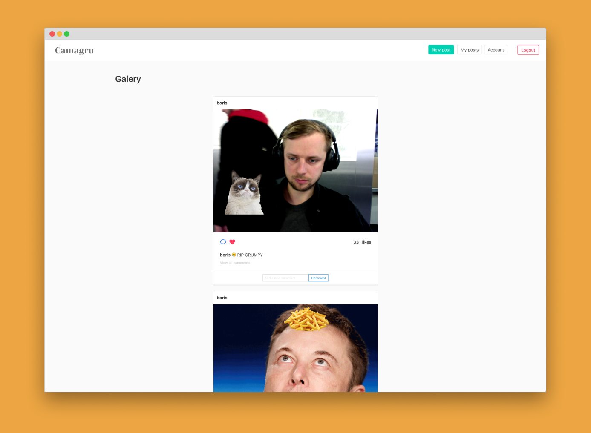
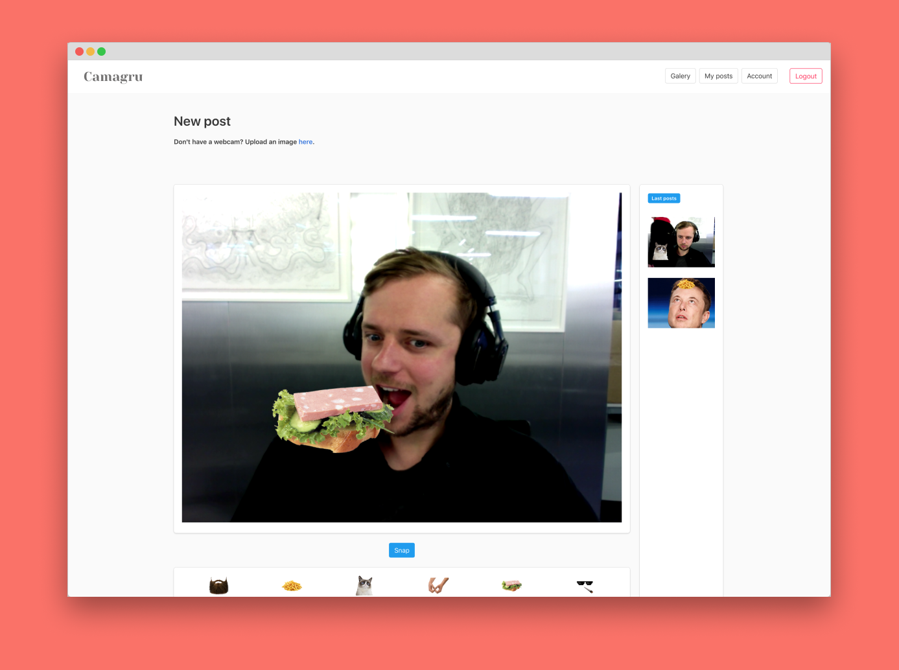
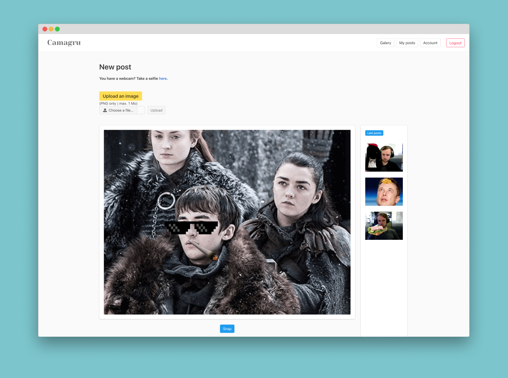

# Camagru

First project on the web branch: building an Instagram like platform.

## Subject
Camagru [subject](https://github.com/bouplusbou/42-camagru/blob/master/readme_assets/camagru.en.pdf)

## Stack
- PHP w/o framework
- MySQL database
- Bulma for the CSS 💅

## Basic features
- DB setup and seed
- Create and manage your user account
- Take selfies from the webcam or upload an image + add a sticker to customise it using WebRTC and the PHP 'GD library'
- Comment and like the posts
- Email notifications (confirm your account, lost password, new comment)
- Basic security (XSS, SQL injections, hashing passwords)


## Bonuses
- MVC structured
- Basic use of OOP
- All the back-end calls use AJAX
- Fine errors handling using Json
- Prevent CSRF using tokens
- Live preview of your selfie
- Drag the stickers where you want
- Infinite Scroll on the galery page
- Enable comments with emojis 😛
- Mirror the webcam for a smoother experience

## Usage

```
// install MAMP https://www.mamp.info/en/downloads/

// put the files in MAMP/apache2/htdocs/

// setup the db
php config/setup.php

// launch the seed
php config/seed.php

// go to http://127.0.0.1:8080/ and have fun !

```

## Visuals
**Galery**
<p align="center">
  
</p>

**Webcam**
<p align="center">
  
</p>

**Upload**
<p align="center">
  
</p>

## Score
[**122**/100]